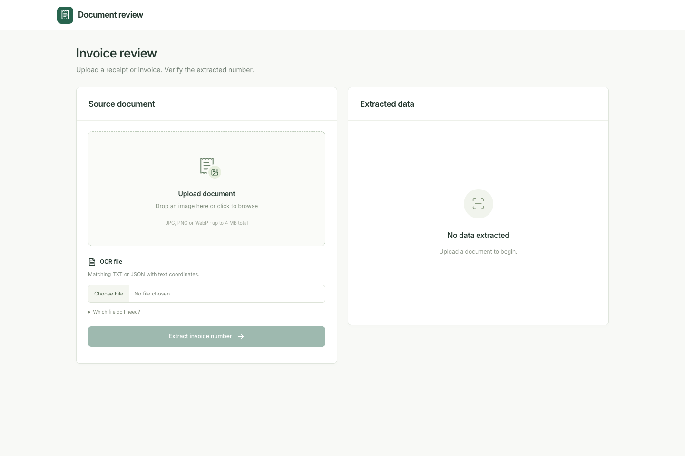
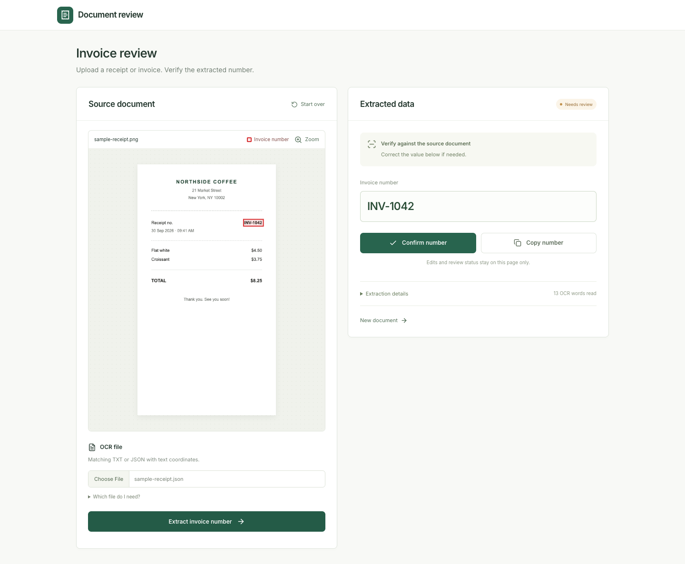
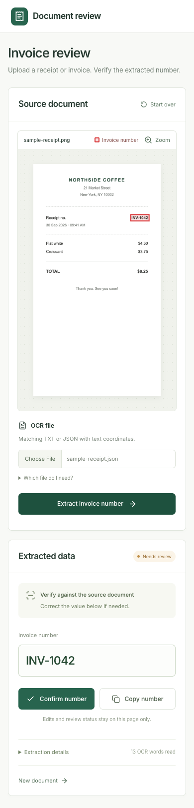

# Invoice NER

Invoice NER extracts invoice numbers from invoice images with heuristics and a local LayoutLMv3 ONNX model, with OpenRouter as an optional fallback. Set `OPENROUTER_API_KEY` to enable the fallback. It includes a FastAPI API, a Gradio upload demo, and a Next.js invoice review frontend.

## Run locally

Requires Python 3.10+ and uv. The large ONNX model is managed outside Git; make it available at the configured model path before starting.

    uv sync --extra dev
    cp .env.example .env
    uv run python -m src.demo --host 127.0.0.1

Open http://127.0.0.1:7860/ for the upload UI or http://127.0.0.1:7860/docs for the API.

To upload a sample invoice and OCR JSON file:

    curl -F 'image=@invoice.jpg' -F 'ocr_file=@ocr.json' http://127.0.0.1:7860/predict

## Tests

    uv run pytest

See [Testing](docs/TESTING.md) for contract and container checks.

## Documentation

- [API usage](docs/API_USAGE.md)
- [Developer setup and data labeling](docs/DEV_SETUP.md)
- [Dataset and labeling notes (Notion)](https://www.notion.so/Dataset-Documentation-Notes-1609faffd568479dbaf1c072b23c472d)
- [Runpod deployment](docs/RUNPOD_CPU_SERVERLESS.md)
- [Monitoring](monitoring/README.md)
- [Benchmarks](benchmarks/README.md)
- [Model card](models/layoutlmv3-lora-invoice-number/README.md)
- [Next.js frontend setup and deployment](frontend/README.md)

## Invoice review frontend

The Next.js interface places the uploaded document beside the extracted invoice
number. When OCR coordinates are available, matching words are highlighted on
the image. Reviewers can edit the number, confirm it, or copy it. See the
[frontend guide](frontend/README.md) for local development and Vercel deployment.

The screenshots use a synthetic receipt and simulated extraction response.





<details>
<summary>Mobile layout</summary>


</details>

## Repository structure

```text
src/                 API, upload UI, and inference
scripts/             Training, preprocessing, and model export
deploy/              Dockerfiles and Runpod worker setup
frontend/            Next.js invoice review app
tests/               Pytest, end-to-end, and load tests
data/  models/        Datasets and model files
docs/  monitoring/    Guides and production monitoring
benchmarks/           Model evaluation
notebooks/            Exploration and analysis
triton_model_repo/    Triton model configuration
```
